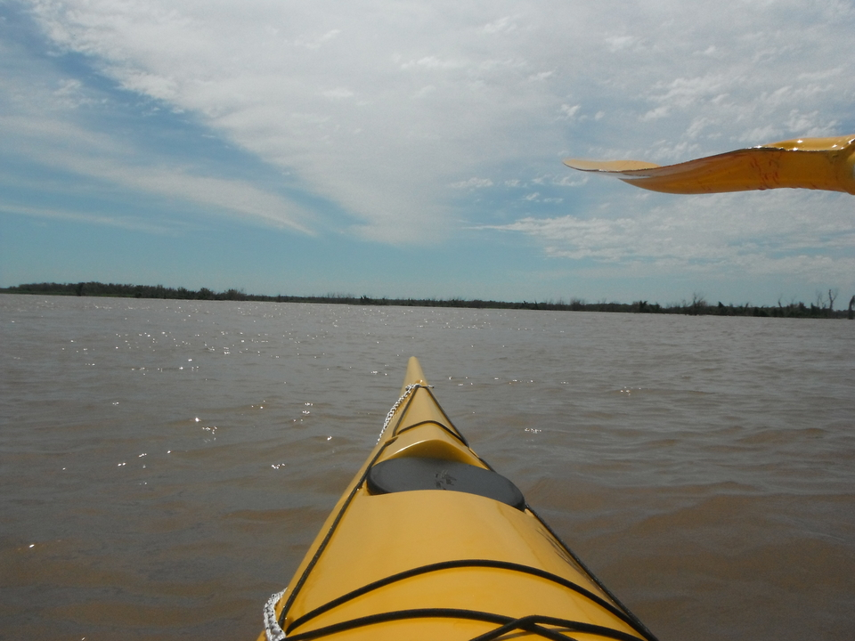
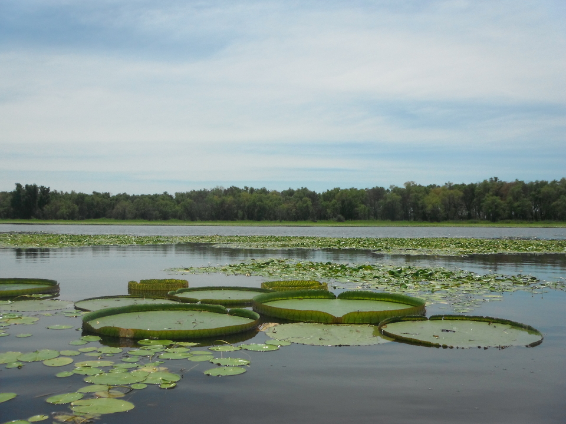
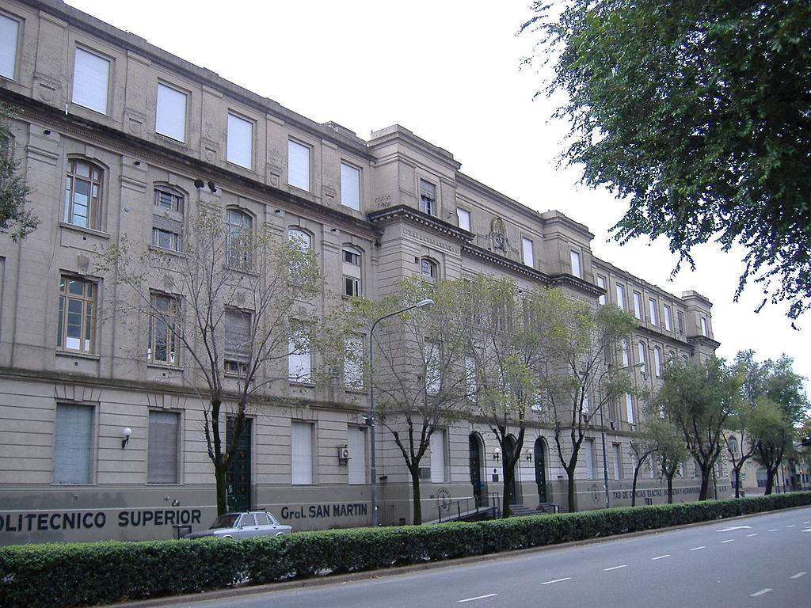
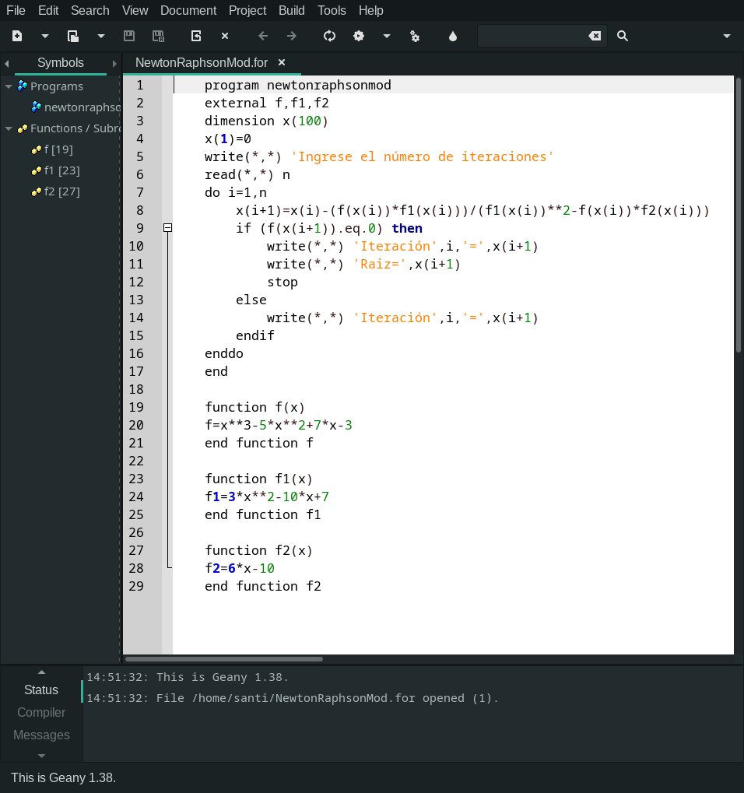
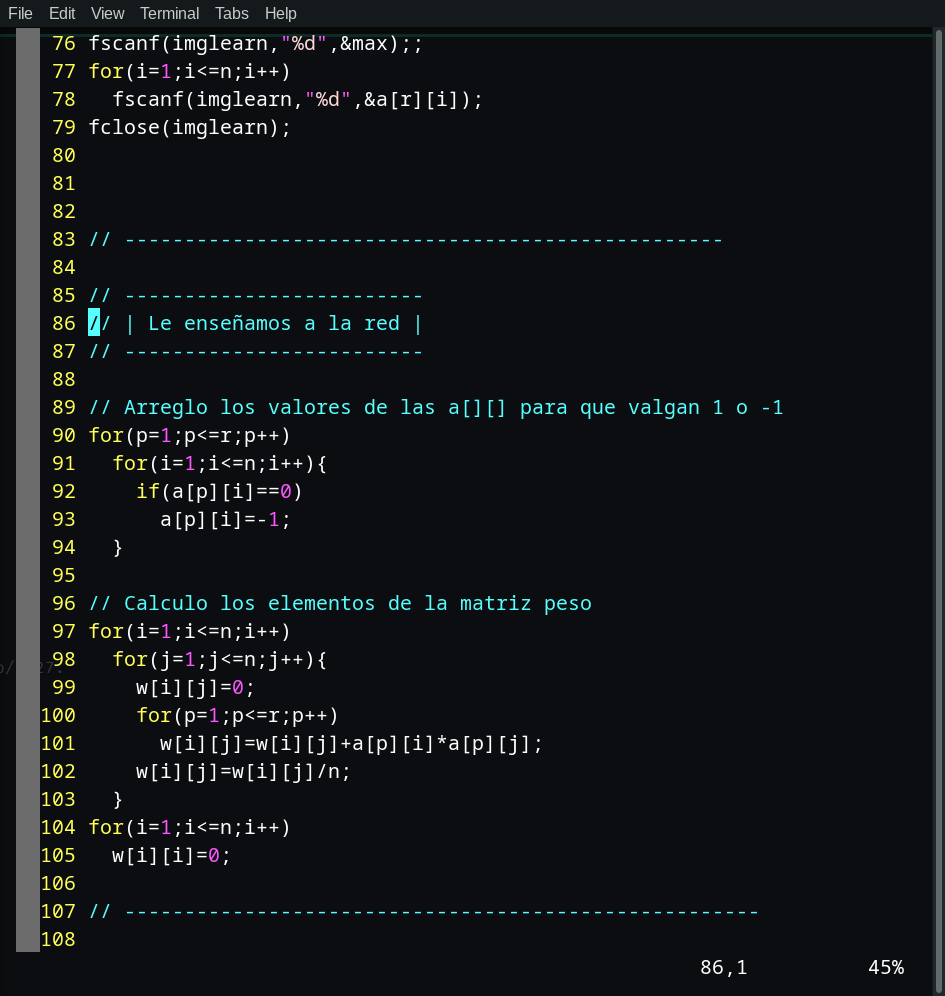
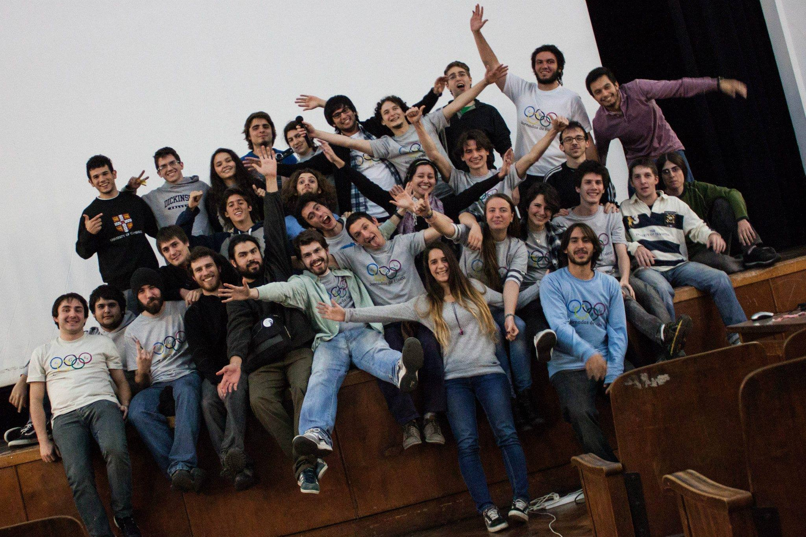
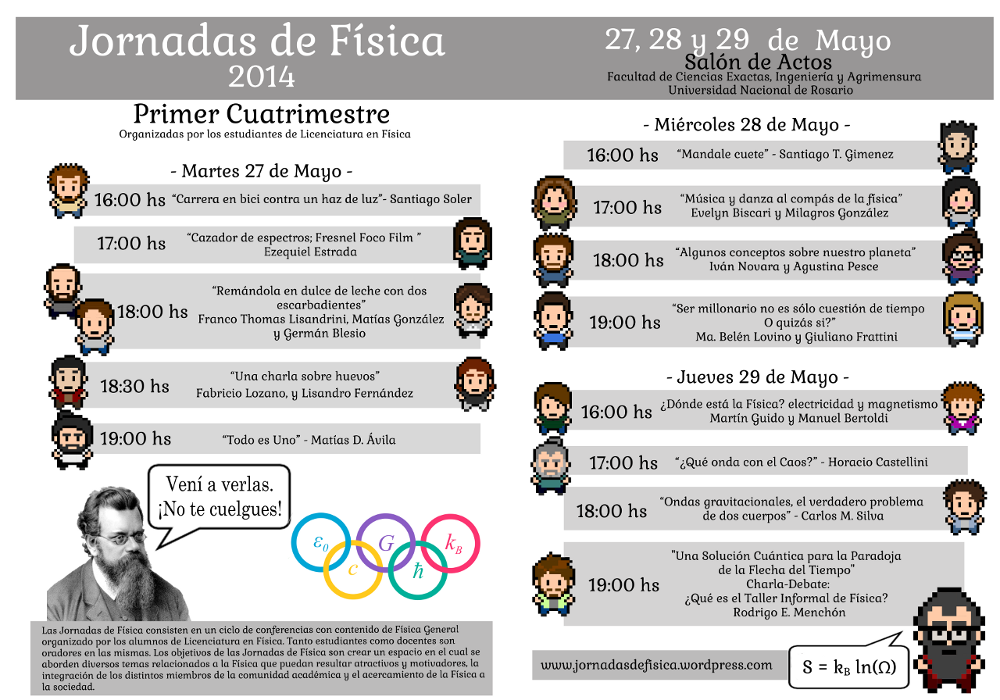
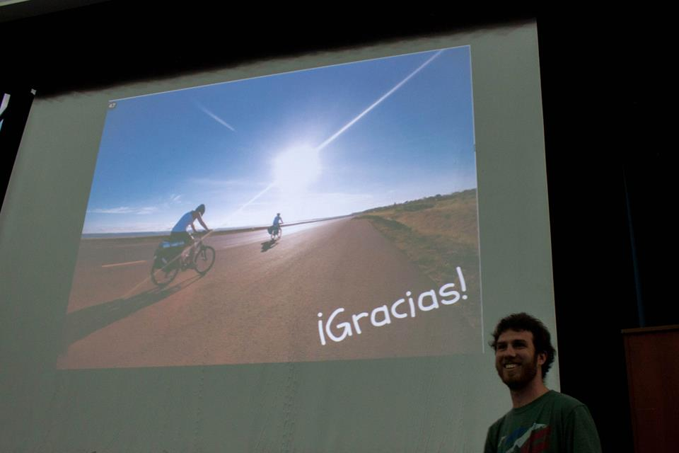
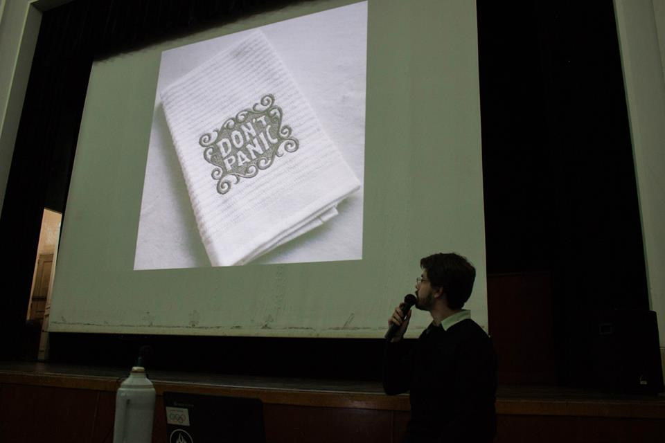
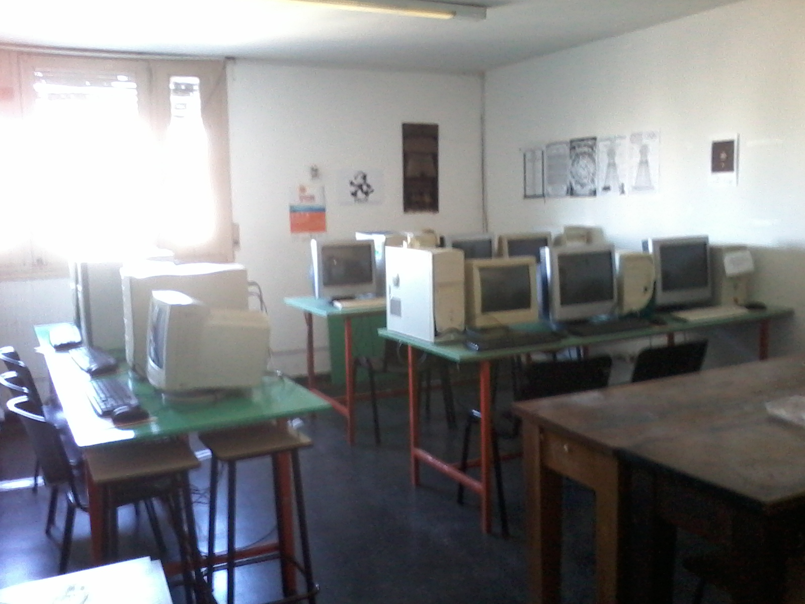

<!-- .slide: class="slide-title" -->

# Empowering science with open-source software

## [Santiago Soler](https://www.santisoler.com)

[*CONICET, Argentina*](https://www.conicet.gov.ar/)
<br>
[*Instituto Geofísico y Sismológico Volponi, UNSJ, Argentina*](http://igsv.unsj.edu.ar/)
<br>
[*Computer-Oriented Geoscience Lab*](https://www.compgeolab.org/)

<div class="container logos">
<div class="logo">
<a href="https://www.conicet.gov.ar/">

</a>
</div>
<div class="logo">
<a href="http://igsv.unsj.edu.ar/">

</a>
</div>
<div class="logo">
<a href="https://www.compgeolab.org/">

</a>
</div>
</div>

- Creative commons
- When?
- Where?
- Social media links


---

# A brief introduction...

<div class="container">

<div class="column">

</div>


<div class="col-2">

<div class="centered">

<ul>
<li class="fragment fade-in">Physicist 👨🏼‍🔬</li>
<li class="fragment fade-in">(recently) PhD in Geophysics 💅🏼</li>
<li class="fragment fade-in">
    Python developer of <a href="https://www.fatiando.org">Fatiando a Terra</a> 🌎
</li>
<li class="fragment fade-in">Member of the <a href="https://www.compgeolab.org">Computer-Oriented Geoscience Lab</a> 🧪🖥️ </li>
</ul>

</div>
</div>

</div>

---

<!-- .slide: data-auto-animate -->

# What is this talk about?

---

<!-- .slide: data-auto-animate -->

# What is this talk about?

I was having the same question some days ago 🤔

---

<!-- .slide: data-auto-animate -->

# What is this talk about?

I was having the same question some days ago 🤔

💡 **Idea**: Let's do something **fun**!

---

<!-- .slide: data-background-color="#1e1e1e" data-background-image="images/88mph.jpg" -->


<h1 style="padding-top: 5vh; ">
⏳ Time travel 🕰️
</h1>

<div class="r-stretch">
</div>

---

<!-- .slide: data-background-video="images/rosario-zoom-in.mp4" -->

<div class="r-stack">
  
  
  
  
  
</div>

---

<!-- .slide: data-background-color="#1e1e1e" data-auto-animate -->

## Licentiate in Physics 🍎

<div class="container">

<div class="col-3">

</div>

<div class="column">


</div>

</div>

---

### Lots of Maths and Physics...

---

<!-- .slide: data-background-color="#1e1e1e" data-background-image="images/plasma.jpg" -->

<h3 style="padding-top: 20vh;">
...cool experiments...
</h3>

---

<!-- .slide: data-background-color="#1e1e1e"  -->

### ...and learn how to code

<div class="container">

<div class="column">

</div>
<div class="column">

</div>

</div>

---

### But also...

---

<!-- .slide: data-background-color="#1e1e1e"  -->

### A welcoming student environment



<div class="footnote">

Source: [jornadasdefisica.wordpress.com](https://jornadasdefisica.wordpress.com/)

</div>

---

### 🏛️ University as a place we could shape ♻️

---

<!-- .slide: data-background-color="#1e1e1e"  -->

### Seminars organized by students

<div class="container">

<div class="col-3">

<a href="https://jornadasdefisica.wordpress.com">

</a>

</div>

<div class="column">


</div>

</div>

---

<!-- .slide: data-background-color="#1e1e1e"  -->

### 🖥️  Mounted our own computer lab 🪛



---

### 🐧 Learned more about Free Software 💻


---

<!-- .slide: data-background-color="#1e1e1e"  -->

✅ Free software as in _"free speech"_,

❌ not as in _"free beer"_

---

<!-- .slide: data-background-color="#2a76dd"  -->

<h1 class="fragment" style="margin-bottom: 100px;">
Explore outside the curriculum,
</h1>

<h1 class="fragment" style="margin-bottom: 100px;">
shape your environment,
</h1>

<h1 class="fragment" style="margin-bottom: 100px;">
do it in community,
</h1>

<h1 class="fragment">
...and have fun! <span style="text-shadow: 2px 2px white">🤓</span>
</h1>

---

##


---

---


# Regular slide

## With subtitles

---

# Include math and equations

$$ E = mc^2 $$

---

## And code

```python
import numpy as np

x = np.linspace(0, 10, 11)
y = x ** 2
```

---

# Do you want columns?

<div class="container">

<div class="column">

</div>

<div class="col-2">
<div class="centered">

* Licenciado en Física (UNR)
* Estudiante de Doctorado en Geofísica (UNSJ)
* Becario Doctoral de CONICET
* Desarrollador de [Fatiando a Terra](https://www.fatiando.org)
* Miembro de [Computer-Oriented Geoscience Lab](https://www.compgeolab.org)

</div>
</div>

</div>

---

# You can add fade-in animations

<div class="container">

<div class="column fragment fade-in">

First element

</div>

<div class="column fragment fade-in">

Second element

</div>

</div>

---

## Even on lists

<ul>
<li class="fragment fade-in">First element</li>
<li class="fragment fade-in">Second element</li>
<li class="fragment fade-in">Third element</li>
</ul>

---

## Highlight current item on list

<ol>
<li class="fragment highlight-current-blue">First element</li>
<li class="fragment highlight-current-blue">Second element</li>
<li class="fragment highlight-current-blue">Third element</li>
</ol>

---

# You can put footnotes

<!-- Stretch to the end of the slide -->
<div class="r-stretch">
</div>

<div class="footnote">

https://www.blog.pythonlibrary.org/2019/04/11/python-used-to-take-photo-of-black-hole/

</div>

---

<!-- .slide: data-background-color="#eee" -->

## You can change the background color

---

## Add quotes

<blockquote>
This is a quote
</blockquote>

---

# Contacto

<div>

<ul class="fa-ul">
<li><i class="fa-li fa fa-envelope"></i>

[santiago.r.soler@gmail.com](mailto:santiago.r.soler@gmail.com)

</li>
<li><i class="fa-li fab fa-twitter"></i>

[@santirsoler](https://twitter.com/santirsoler)

</li>
<li><i class="fa-li fa fa-globe-americas"></i>

[www.santisoler.com](https://www.santisoler.com)

</li>
</ul>

</div>

---

<!-- .slide: class="slide-license" -->

<p class="license-icons">
<i class="fab fa-creative-commons"></i><i class="fab fa-creative-commons-by"></i>
</p>

El contenido de esta presentación está disponible bajo

[Creative Commons Attribution 4.0 International License](https://creativecommons.org/licenses/by/4.0/)

---

<!-- .slide: class="slide-title" -->

# Muchas gracias
