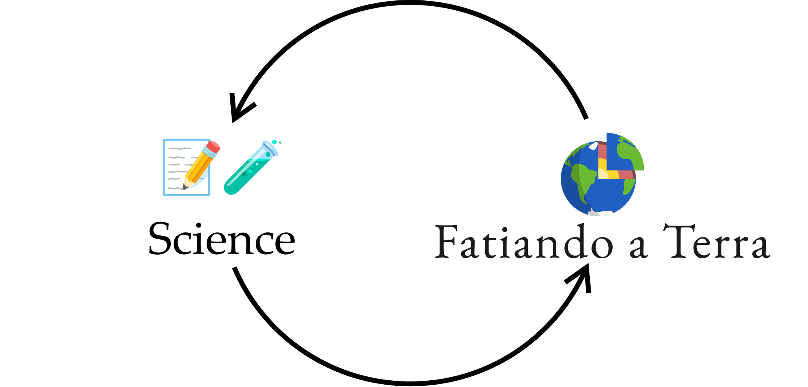
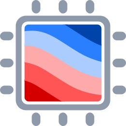

<!-- .slide: class="slide-title" data-background-color="#1e1e1e" --> <div class="title"> # Empowering science with open-source software
## by Santiago Soler

<hr>

<i class="fas fa-university"></i>
Instituto de Astronomia, Geofísica e Ciências Atmosféricas, USP

<i class="fas fa-calendar-alt"></i> 19 May 2022

<p style="margin-top: 3rem">
<a href="https://www.santisoler.com">
<i class="fas fa-globe"></i>
www.santisoler.com
</a>
</p>

<p>
<a href="https://github.com/santisoler">
<i class="fab fa-github"></i>
@santisoler
</a>
</p>

<p>
<a href="https://twitter.com/santirsoler">
<i class="fab fa-twitter"></i>
@santirsoler
</a>
</p>

<p>
<a href="https://scicomm.xyz/@santisoler">
<i class="fab fa-mastodon"></i>
@santisoler@scicomm.xyz
</a>
</p>

</div>

<div class="r-stretch">
</div>

<!-- Bottom divs -->
<div class="flex flex-row justify-space-between">


<!-- Left div -->
<div class="flex flex-row">


<!-- Links to slides -->
<div style="margin-left: 2rem;">
<p>
<i class="fas fa-chalkboard"></i>
Slides: <a href="https://santisoler.com/iag-usp-2022">
santisoler.com/iag-usp-2022
</a>
</p>
<p>
<i class="fas fa-camera"></i>
Feel free to screenshot, share and reuse this presentation
</p>
<p>
<i class="fab fa-creative-commons"></i>
<i class="fab fa-creative-commons-by"></i>
CC-BY
</p>
</div>
</div>

<!-- Compgeolab figure -->
<div class="flex flex-row align-end ">
<a href="https://www.compgeolab.org/">

</a>
</div>

</div>

---

## A brief introduction...

<div class="container">

<div class="column">

</div>

<div class="column v-centered">
<ul>
<li class="fragment fade-in">Physicist 👨🏼‍🔬</li>
<li class="fragment fade-in">(recently) PhD in Geophysics 💅🏼</li>
<li class="fragment fade-in">
    Python developer of <a href="https://www.fatiando.org">Fatiando a Terra</a> 🌎
</li>
<li class="fragment fade-in">Member of the <a href="https://www.compgeolab.org">Computer-Oriented Geoscience Lab</a> 🧪🖥️ </li>
</ul>
</div>

</div>

---

<!-- .slide: data-background-color="#1e1e1e" data-background-image="images/88mph.jpg" -->


<h1 style="padding-top: 5vh; ">
⏳ Time travel 🕰️
</h1>

<div class="r-stretch">
</div>

---

<!-- .slide: data-background-color="#1e1e1e" data-background-video="images/rosario-zoom-in.mp4" data-background-size="contain" -->

<div class="r-stack">
  
  
  
  
  
</div>

---

<!-- .slide: data-auto-animate -->

# Licentiate in Physics 🍎

<div class="container">

<div class="col-3">

</div>

<div class="column">


</div>

</div>

---

### Lots of Maths and Physics...

---

<!-- .slide: data-background-color="#1e1e1e" data-background-image="images/plasma.jpg" -->

<h3 style="padding-top: 1.8em;">
...cool experiments...
</h3>

---

<!-- .slide: data-background-color="#1e1e1e"  -->

### ...and learn how to code

<div class="container">

<div class="column">

</div>
<div class="column">

</div>

</div>

---

### But also...

---

<!-- .slide: data-background-color="#1e1e1e"  -->

### A welcoming student environment


<div class="footnote">

Source: [jornadasdefisica.wordpress.com](https://jornadasdefisica.wordpress.com/)

</div>

---

<!-- .slide: data-background-color="#1e1e1e"  -->

### Seminars organized by students

<div class="container">

<div class="col-3">

<a href="https://jornadasdefisica.wordpress.com">

</a>

</div>

<div class="column">


</div>

</div>

---

<!-- .slide: data-background-color="#1e1e1e"  -->

### 🖥️  Mounted our own computer lab 🪛


---

### 🐧 Learned more about Free Software 💻


---

<!-- .slide: data-background-color="#1e1e1e"  -->

✅ Free software as in _"free speech"_,

❌ not as in _"free beer"_

---

### 🏛️ University as a place we could shape ♻️

---

<!-- .slide: data-background-color="#2a76dd"  -->

<h1 class="fragment" style="margin-bottom: 100px;">
Explore outside the curriculum,
</h1>

<h1 class="fragment" style="margin-bottom: 100px;">
shape your environment,
</h1>

<h1 class="fragment" style="margin-bottom: 100px;">
do it in community,
</h1>

<h1 class="fragment">
...and have fun! <span style="text-shadow: 2px 2px white">🤓</span>
</h1>

---

## Fast-forward

## \>\>\>

---

<!-- .slide: data-background-color="#1e1e1e" data-background-video="images/sanjuan-zoom-in.mp4" data-background-size="contain" -->

---

## Licentiate Thesis

<div class="container">

<div class="col-2">

</div>

<div class="column v-centered align-center">
<p>
Instituto Geofísico Sismológico Volponi
</p>


</div>

</div>

---

### Gravity + magnetics


---

<!-- .slide: data-background-color="#1e1e1e" data-auto-animate -->

### Expensive privative software

---

<!-- .slide: data-auto-animate data-background-color="#1e1e1e" -->

### Expensive privative software

<ul class="emojis">
<li class="fragment cross">Reproducible science</li>
<li class="fragment cross">Study the code</li>
<li class="fragment cross">Build on top</li>
</ul>

---

<!-- .slide: data-auto-animate -->

### Write my own code

---

<!-- .slide: data-auto-animate -->

### Write my own code

Fortran? <!-- .element: class="fragment" -->

C? <!-- .element: class="fragment" -->

---

<!-- .slide: data-auto-animate -->

### Write my own code

~Fortran?~

~C?~

---

<!-- .slide: data-auto-animate data-background-color="#1e1e1e" -->

 <!-- .element style="width: 70%" -->

I can code faster! <!-- .element class="fragment" -->

---

<div class="large">

🤔

</div>

But... what if someone already coded something like this?

---

<!-- .slide: data-background-color="#1e1e1e" data-background-video="images/fatiando-duckduckgo.mp4" data-background-size="contain" -->

---

## Leonardo Uieda

<div class="container">

<div class="column">

 <!-- .element style="margin-top: 5%; border-radius: 50%; width: 80%;" -->

<a href="https://github.com/leouieda">
<i class="fab fa-github"></i>
</a>
<a href="https://twitter.com/leouieda">
<i class="fab fa-twitter"></i>
</a>
<a href="https://scicomm.xyz/@leouieda">
<i class="fab fa-mastodon"></i>
</a>
@leouieda
<br>
<a href="https://www.leouieda.com">
<i class="fas fa-globe"></i>
leouieda.com
</a>

</div>
<div class="col-2 v-centered">

- BSc in Geophysics (USP)
- PhD in Geophysics (Observatório Nacional)
- Lecturer at the University of Liverpool
- OSS developer:
    - [Fatiando a Terra](https://www.fatiando.org) 🌎
    - [Generic Mapping Tools](https://www.generic-mapping-tools.org/) 🗺️
    - [PyGMT](https://www.pygmt.org/) 🗺️🐍


</div>

---

Python <!-- .element: class="fragment" -->

\+ Scientific stack <!-- .element: class="fragment" -->

\+ Fatiando <!-- .element: class="fragment" -->

<hr class="fragment" style="width: 50%">

🎉 Finished Licentiate Thesis 🎉 <!-- .element: class="fragment" -->

---

Meanwhile...

first contributions to Fatiando <!-- .element: class="fragment" -->

---

<!-- .slide: data-background-image="images/santi-first-pr.png" data-background-size="contain" data-background-color="#0d1117" -->

---

<!-- .slide: data-auto-animate data-background-color="#1e1e1e" -->

# PhD in Geophysics

---

<!-- .slide: data-auto-animate data-background-color="#1e1e1e" -->

# PhD in Geophysics

<div class="container">

<div class="column">

 <!-- .element: style="margin-top: 5%; border-radius: 50%; width: 50%;" -->

**Advisor**
<br>
Mario Gimenez

</div>

<div class="column fragment">

 <!-- .element: style="margin-top: 5%; border-radius: 50%; width: 50%;" -->


**Coadvisor** <br> Leonardo Uieda

</div>

</div>

---

## Goal

Modelling tesseroids with variable densities

---

<!-- .slide: data-auto-animate -->

### What is a tesseroid?

---

<!-- .slide: data-auto-animate -->

### What is a tesseroid?

 <!-- .element: style="width: 40%" -->

---

<!-- .slide: data-auto-animate -->

### The challenge

---

<!-- .slide: data-auto-animate -->

### The challenge

$$
    V(\mathbf{p}) = G \rho
        \int\limits_{r_1}^{r_2}
        \int\limits_{\lambda_1}^{\lambda_2}
        \int\limits_{\phi_1}^{\phi_2}
        \frac{\kappa}{\left\lVert \mathbf{p} - \mathbf{q} \right\rVert}
        \text{d} r' \text{d} \lambda' \text{d} \phi',
$$

❌ No analytical solution

✅ Numerical approximation <!-- .element class="fragment" -->

---

<!-- .slide: data-auto-animate -->

### The challenge

$$
    V(\mathbf{p}) = G
        \int\limits_{r_1}^{r_2}
        \int\limits_{\lambda_1}^{\lambda_2}
        \int\limits_{\phi_1}^{\phi_2}
        \frac{
            {\color{orange} \rho(r')} \kappa
        }{
            \left\lVert \mathbf{p} - \mathbf{q} \right\rVert
        }
        \text{d} r' \text{d} \lambda' \text{d} \phi',
$$

<p>
Open problem:
<span style="color: orange">
Variable density tesseroids
</span>
</p>

---

After some work... 😓

---

### Solved it!

<div class="fragment">

**New method:** built on top of existing tesseroids in Fatiando

</div>

---

### Published it 📕

---

<!-- .slide: data-background-image="./images/soler2019.png" data-background-size="contain" -->

<div class="r-stretch">
</div>

<div class="footnote shadow" style="background-color: #fff; padding: 6px 6px; width: 20%; shadow: ">

doi: [10.1093/gji/ggz277](https://doi.org/10.1093/gji/ggz277)

</div>

---

### And also...

---

<!-- .slide: data-background-image="./images/soler2019-preprint.png" data-background-size="contain" -->

<div class="r-stretch">
</div>

<div class="footnote shadow" style="background-color: #fff; padding: 6px 6px; width: 20%; shadow: ">

doi: [10.31223/osf.io/3548g](https://doi.org/10.31223/osf.io/3548g)

</div>

---

<!-- .slide: data-background-image="./images/soler2019-repo.png" data-background-size="contain" data-background-color="#0d1117" -->

<div class="r-stretch">
</div>

<div class="footnote shadow" style="background-color: #fff; padding: 6px 6px; width: 31%; shadow: ">

<a href="https://github.com/pinga-lab/tesseroid-variable-density/">
<p>
<i class="fab fa-github"></i>
pinga-lab/tesseroid-variable-density
</p>
</a>

</div>

---

### But that wasn't enough


💡 Easier way to use the new method: 💡 <!-- .element class="fragment" -->

**include it in Fatiando 🌎** <!-- .element class="fragment" -->

---

### What was going on in Fatiando back then?

---

<!-- .slide: data-background-image="images/fatiando-legacy.png" data-background-size="contain" -->

# Deprecated <!-- .element: class="fragment rotated" style="color: #fff; padding: 20px; background-color: #d62728; " -->

---

<!-- .slide: data-background-image="images/fatiando-website.png" data-background-size="contain" data-background-color="#060629" -->

---

<!-- fatiando libraries -->

<!-- Describe the libraries we have today -->

---

<div class="container small">

<div class="column">

### ✨ New Fatiando ✨ <!-- .element style="font-size: 1em;" -->

Split into libraries

Better coding practices

Use modern tools

Supplement the ecosystem

</div>

<!-- Pooch -->
<div class="column fragment">

<a href="http://www.fatiando.org/pooch">

</a>

Data <b>download & caching</b>

<ul class="fa-ul project-icons">
<li><i class="fa-li fab fa-github fa-fw" title="Github repository"></i>
   <a href="https://github.com/fatiando/pooch">fatiando/pooch</a>
</li>
<li><i class="fa-li fas fa-bookmark fa-fw" title="Publication"></i>
   doi: <a href="https://doi.org/10.21105/joss.01943">10.21105/joss.01943</a>
</li>
<li><i class="fa-li fa fa-check fa-fw" style="color: green" title="Project status"></i>
   Stable and ready for use
</li>
</ul>

</div>

<!-- Verde -->
<div class="column fragment">

<a href="http://www.fatiando.org/verde">

</a>

ML-based point data processing and <b>gridding</b>

<ul class="fa-ul project-icons">
<li><i class="fa-li fab fa-github fa-fw" title="Github repository"></i>
   <a href="https://github.com/fatiando/verde">fatiando/verde</a>
</li>
<li><i class="fa-li fas fa-bookmark fa-fw" title="Publication"></i>
   doi: <a href="https://doi.org/10.21105/joss.00957">10.21105/joss.00957</a>
</li>
<li><i class="fa-li fa fa-check fa-fw" style="color: green" title="Project status"></i>
   Stable and ready for use
</li>
</ul>

</div>
</div>

<div class="container small" style="margin-top: 4%">

<!-- Harmonica -->
<div class="column fragment">

<a href="http://www.fatiando.org/harmonica">

</a>

Processing and modeling <br> <b>gravity & magnetic</b> data

<ul class="fa-ul project-icons">
<li><i class="fa-li fab fa-github fa-fw" title="Github repository"></i>
   <a href="https://github.com/fatiando/harmonica">fatiando/harmonica</a>
</li>
<li><i class="fa-li fa fa-sync-alt fa-fw" style="color: green" title="Project status"></i>
   Ready for use but still changing
</li>
</ul>

</div>
<div class="column fragment">

<!-- Boule -->
<a href="http://www.fatiando.org/boule">

</a>

Reference <b>ellipsoids</b> for <b>normal gravity</b>

<ul class="fa-ul project-icons">
<li><i class="fa-li fab fa-github fa-fw" title="Github repository"></i>
   <a href="https://github.com/fatiando/boule">fatiando/boule</a>
</li>
<li><i class="fa-li fa fa-sync-alt fa-fw" style="color: green" title="Project status"></i>
   Ready for use but still changing
</li>
</ul>

</div>
<div class="column fragment">

<!-- Ensaio -->
<a href="http://www.fatiando.org/ensaio">

</a>

**Practice datasets** to probe your code

<ul class="fa-ul project-icons">
<li><i class="fa-li fab fa-github fa-fw" title="Github repository"></i>
   <a href="https://github.com/fatiando/ensaio">fatiando/ensaio</a>
</li>
<li><i class="fa-li fa fa-sync-alt fa-fw" style="color: green" title="Project status"></i>
    Functional but still evolving
</li>
</ul>

</div>
</div>

---

<!-- .slide: data-background-color="#1e1e1e" data-auto-animate -->

### Variable density tesseroids in Harmonica

---

<!-- .slide: data-background-color="#1e1e1e" data-auto-animate -->

### Variable density tesseroids in Harmonica

<pre style="height: 90vh">
<code data-trim data-line-numbers="1-5|7-8|10-11|13-19|21-26|28-29" class="python" >
# Import some packages
from numba import njit
import boule as bl
import verde as vd
import harmonica as hm

# Get mean Earth radius from WGS84 ellipsoid using Boule
mean_radius = bl.WGS84.mean_radius

# Define a single tesseroid
tesseroid = [-70, -60, -40, -30, mean_radius - 5e3, mean_radius]

# Define a density function for the tesseroid
@njit
def density(radius):
    bottom, top = mean_radius - 5e3, mean_radius
    density_bottom, density_top = 2900, 2670
    slope = (density_top - density_bottom) / (top - bottom)
    return slope * (radius - bottom) + density_bottom

# Define computation points
coordinates  = vd.grid_coordinates(
    region=(-80, -50, -50, -20),
    spacing=5,
    extra_coords=100e3 + mean_radius
)

# Compute gravity field
gravity = hm.tesseroid_gravity(coordinates, tesseroid, density, field="g_z")

</code>
</pre>

---

## Feedback



---

<!-- .slide: data-background-color="#1e1e1e" -->

<div class="large">

Empower science with OSS...

...empower OSS with science <!-- .element: class="fragment" -->

</div>

---

Similar story with following research:

**Gradient boosted equivalent sources** <!-- .element: class="fragment" -->

---

<!-- .slide: data-background-image="images/soler2021.png" data-background-size="contain" -->

---

<!-- .slide: data-background-image="images/harmonica-gradient-boosted-eqs.png" data-background-size="contain" -->

---

## 🎉 Finished the PhD 🎉

---

### I wasn't alone

<div class="container small">

<div class="column">


Fatiando <br> [fatiando.org](https://www.fatiando.org)

</div>

<div class="column">


Software Underground
<br> [softwareunderground.org](https://softwareunderground.org/)

</div>

<div class="column">



Computer-Oriented Geoscience Lab
<br> [compgeolab.org](https://www.compgeolab.org/)

</div>


</div>

<div class="container small">

<div class="column">


Geolatinas
<br> [geolatinas.weebly.com](https://geolatinas.weebly.com/)

</div>

<div class="column">


The Carpentries
<br> [carpentries.org](https://carpentries.org/)

</div>

</div>

---

<!-- .slide: data-background-color="#2a76dd"  -->

<h1 class="fragment" style="margin-bottom: 100px;">

Explore outside the curriculum,

</h1>

<h1 class="fragment" style="margin-bottom: 100px;">
shape your environment,
</h1>

<h1 class="fragment" style="margin-bottom: 100px;">
do it in community,
</h1>

<h1 class="fragment">
...and have fun! <span style="text-shadow: 2px 2px white">🤓</span>
</h1>

---

# Regular slide

## With subtitles

---

# Include math and equations

$$ E = mc^2 $$

---

## And code

```python
import numpy as np

x = np.linspace(0, 10, 11)
y = x ** 2
```

---

# Do you want columns?

<div class="container">

<div class="column">

</div>

<div class="col-2">
<div class="centered">

* Licenciado en Física (UNR)
* Estudiante de Doctorado en Geofísica (UNSJ)
* Becario Doctoral de CONICET
* Desarrollador de [Fatiando a Terra](https://www.fatiando.org)
* Miembro de [Computer-Oriented Geoscience Lab](https://www.compgeolab.org)

</div>
</div>

</div>

---

# You can add fade-in animations

<div class="container">

<div class="column fragment fade-in">

First element

</div>

<div class="column fragment fade-in">

Second element

</div>

</div>

---

## Even on lists

<ul>
<li class="fragment fade-in">First element</li>
<li class="fragment fade-in">Second element</li>
<li class="fragment fade-in">Third element</li>
</ul>

---

## Highlight current item on list

<ol>
<li class="fragment highlight-current-blue">First element</li>
<li class="fragment highlight-current-blue">Second element</li>
<li class="fragment highlight-current-blue">Third element</li>
</ol>

---

# You can put footnotes

<!-- Stretch to the end of the slide -->
<div class="r-stretch">
</div>

<div class="footnote">

https://www.blog.pythonlibrary.org/2019/04/11/python-used-to-take-photo-of-black-hole/

</div>

---

<!-- .slide: data-background-color="#eee" -->

## You can change the background color

---

## Add quotes

<blockquote>
This is a quote
</blockquote>

---

# Contacto

<div>

<ul class="fa-ul">
<li><i class="fa-li fa fa-envelope"></i>

[santiago.r.soler@gmail.com](mailto:santiago.r.soler@gmail.com)

</li>
<li><i class="fa-li fab fa-twitter"></i>

[@santirsoler](https://twitter.com/santirsoler)

</li>
<li><i class="fa-li fa fa-globe-americas"></i>

[www.santisoler.com](https://www.santisoler.com)

</li>
</ul>

</div>

---

<!-- .slide: class="slide-license" -->

<p class="license-icons">
<i class="fab fa-creative-commons"></i><i class="fab fa-creative-commons-by"></i>
</p>

El contenido de esta presentación está disponible bajo

[Creative Commons Attribution 4.0 International License](https://creativecommons.org/licenses/by/4.0/)

---

<!-- .slide: class="slide-title" -->

# Muchas gracias
